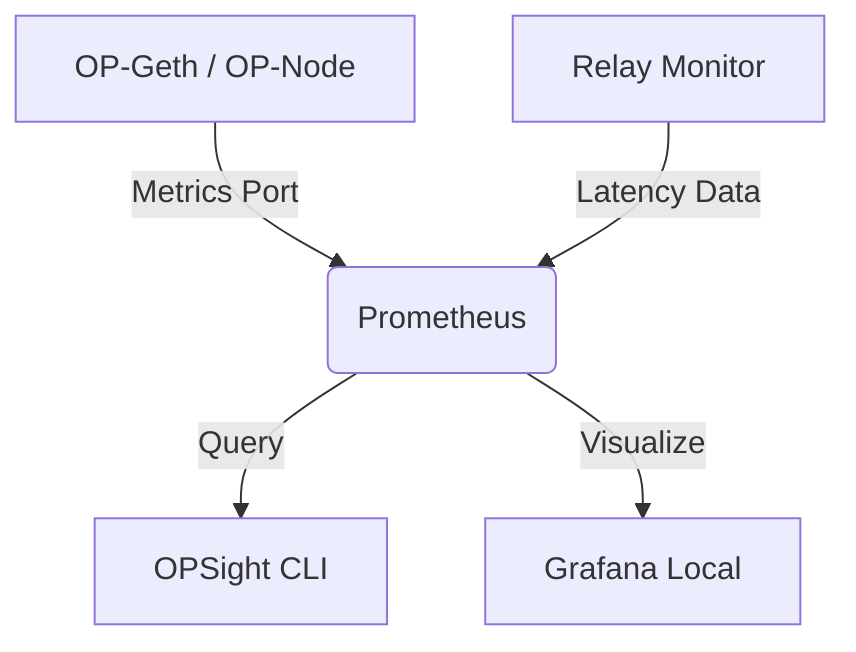

# OPSight: Local-First Optimism Observability Stack

> **Status:** 🚧 **Concept & Architecture Phase** 🚧

**OPSight** is a lightweight, local-first observability solution designed specifically for **Optimism (OP Stack)** node operators and developers.

Running an OP Node shouldn't require expensive cloud monitoring subscriptions. OPSight provides a **cost-free, privacy-focused** alternative to tools like Datadog, offering real-time health checks, cross-chain sync status, and relay latency metrics directly from your terminal or a local Grafana dashboard.

## ⚡ Project Vision

In the decentralized web, node observability is often fragmented or costly. OPSight bridges this gap by offering:
* **Zero-Cost Monitoring:** No external SaaS dependencies. Runs entirely on your local machine alongside your node.
* **CLI Dashboard:** A TUI (Terminal User Interface) for checking node health via SSH without needing a web browser.
* **Superchain Ready:** Architected to support multiple OP chains (Optimism, Base, Zora, etc.) simultaneously.

## 🏗 Architecture

OPSight acts as a bridge between your raw node metrics and actionable insights:

## 👨‍💻 About the Developer & Track Record

OPSight is built by an experienced infrastructure engineer and open-source contributor, utilizing learnings from previous successful grant-funded projects in the Web3 ecosystem.

Our goal is to bring the same level of tooling maturity to the Superchain ecosystem.

### 🏆 Portfolio & Previous Work

| Project | Ecosystem | Description | Status |
| :--- | :--- | :--- | :--- |
| **[ArbiSight](https://github.com/bytemaster333/Arbisight)** | **Arbitrum** | AI-powered log analysis and observability tool for Arbitrum nodes. Winner of the **Arbitrum DAO Grant**. | ✅ **Completed** |
| **[Stellar Soroban Monitor](https://github.com/bytemaster333/stellar-command-insights-release)** | **Stellar** | Security and transaction analysis tool for Soroban smart contracts. | ✅ **Completed** |

*(Note: Please check my GitHub profile for the Stellar project details.)*

## 🚀 Roadmap

- [x] **Phase 1: Architecture & Design** (Completed)
- [ ] **Phase 2: MVP Development**
    - [ ] Core Go/Rust CLI implementation
    - [ ] Docker-compose templates for "One-Click" setup
- [ ] **Phase 3: Advanced Metrics**
    - [ ] P2P Peer health scoring
    - [ ] Sequencer drift alerting

## 🛠 Tech Stack

* **Core:** Go (Golang) / Rust
* **Monitoring:** Prometheus, Grafana
* **Infrastructure:** Docker, Ansible
* **OS:** Linux Optimized

---

### Contact

**Salih Toruner** - *Linux Systems Engineer & DevOps*
[GitHub Profile](https://github.com/bytemaster333)
